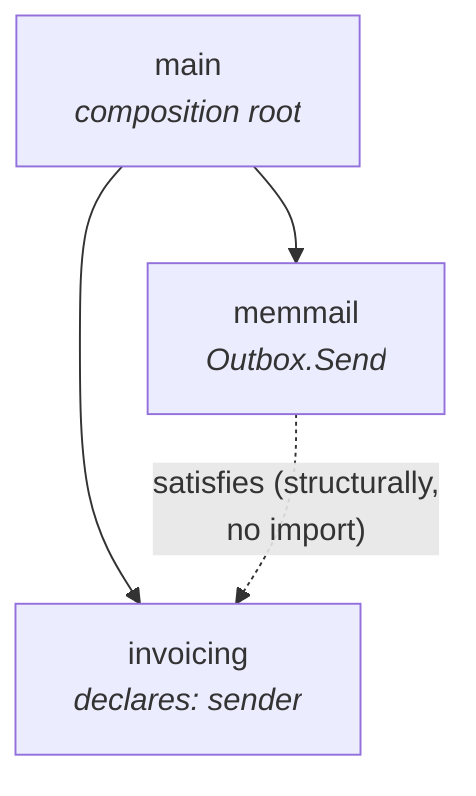

# Example: dependency direction in Go

Minimal program applying the `go-dependency-direction` skill. It formats an invoice and sends it as a message. What matters is not what it does, but **who imports whom**.

## Structure

```
main.go                     composition root: imports both sides
invoicing/service.go        caller: validates, formats, sends
memmail/outbox.go           implementation: collects messages in memory
invoicing/service_test.go
```

## The import graph



Two solid arrows, both out of `main`. Nothing points back, and `invoicing` ↔ `memmail` have no import edge in either direction — the dotted line is Go's structural matching, resolved at the injection point in `main`, not a dependency.

## The rule across three files

**The caller declares the interface.** `invoicing` has to hand a message to something, so it writes down the shape it uses right there — one method, unexported:

```go
type sender interface {
	Send(ctx context.Context, to, subject, body string) error
}
```

It does not import `memmail`. It does not know `memmail` exists.

**The implementation knows nobody.** `memmail.Outbox` happens to have a matching `Send`; it declares no interface and imports no project package. Go resolves the match structurally, at the point of injection.

**`main` is the only place that names the concrete type.** That is where `*memmail.Outbox` is built and handed to `NewService`. Swapping in a real SMTP client is a two-line edit in `main.go`; nothing else notices.

Neither package has to change when the other does. That is what the arrangement buys — and it is visible in the import lists, not in a diagram.

## Verification

```sh
go test ./...
go run .          # to=ada@example.com subject="Invoice INV-1" body="Amount due: $49.99"

go list -f '{{.ImportPath}} -> {{.Imports}}' ./...
```

The last one prints the whole architecture:

```
example/billing           -> [context example/billing/invoicing example/billing/memmail fmt log]
example/billing/invoicing -> [context fmt]
example/billing/memmail   -> [context sync]
```

Only `main` names a project package. The other two are stdlib-only: delete either and the survivor still builds. That is the honest test the skill asks for; a folder name proves nothing.

## The payoff: testability

The fake in `service_test.go` is four lines, because the interface has one method. A three-method interface owned by the implementation would force partial, awkward mocks:

```go
type fakeSender struct {
	to, subject, body string
	err               error
}

func (f *fakeSender) Send(_ context.Context, to, subject, body string) error { ... }
```

The `invoicing` test imports no mail package. No SMTP server, no setup, no teardown.

## What the example deliberately does not do

- `memmail` is a slice behind a mutex, not a mail transport. Replaceable by design; that is the point.
- No interface for anything with a single implementation that is never faked. The rule is about direction, not about abstracting everything.
- No `domain/`, `usecase/`, or `infrastructure/` folders. The names buy nothing; the import graph does.

---

Copyright 2026 Rodolfo González González.

MIT licensed, see [`../../../LICENSE`](../../../LICENSE). Rules distilled from [*Forget clean architecture — Master dependency direction in Go*](https://blog.stackademic.com/forget-clean-architecture-master-dependency-direction-in-go-2c875193e940) by Yaninyz witty; this program is original.
